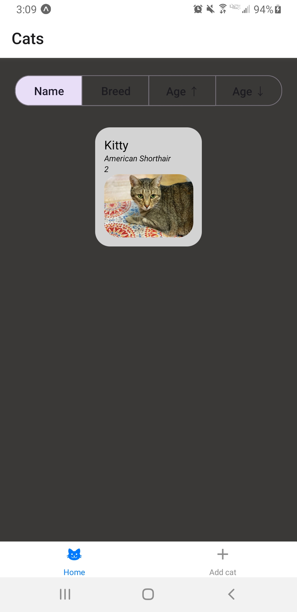
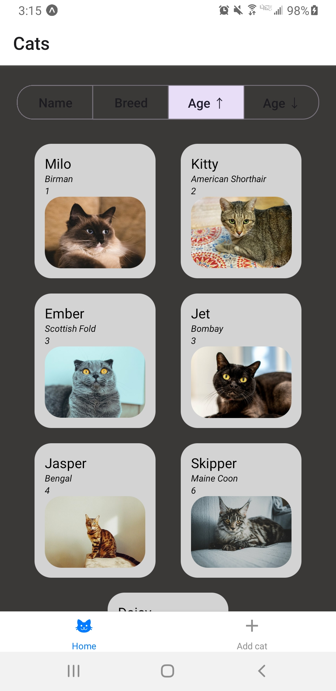

# CatTrax

CatTrax is a simple cat manager mobile app that allows a user to add, view, update, and delete cats. This application was built using React Native, Expo, and React Native Paper.

## Features

- View a list of all added cats sorted by name or breed in alphabetical order or by age in ascending or descending order

- Add a cat to the list with its details: name, breed, age, favorite foods, description, and an image

- View a cat including all its details

- Edit a cat's details

- Remove a cat from the list

## Installation

To install and run this app, you will need Node.js, Expo CLI, and all app dependencies installed on your computer. Globally install Expo CLI by running `npm install -g expo-cli`. Next, clone the repo and run `npm install` to install all required app dependencies. Start the development server by running `npx expo start`. If this command does not work, try running `npx expo start --tunnel` as sometimes router configurations might be the issue. Download the Expo Go app on your phone and scan the QR code shown in the terminal. Please reference the [Expo documentation](https://docs.expo.dev/get-started/installation/) for troubleshooting.

## Demo

### Splash screen

The user views the splash screen for CatTrax as the app loads.

### Home screen - empty

The user is prompted to begin adding cats. The user can sort cats by name or breed in alphabetical order and can sort cats by age in ascending or descending order.

### Add cat screen - empty

The user has several fields to fill out a cat's details: name, breed, age, favorite foods, description, and an image of the cat. The user can select an image to upload from the phone’s camera roll and apps associated with it such as a Google Drive.

### Add cat screen - filled

The user can scroll through the form's input if it exceeds its container. This is shown in the screenshot where the scroll area is being pulled down, and the scrollbar can be seen on the right of the container.

### Home screen - cat added

After pressing submit in the cat added screen, the user is redirected to the home page where the newly added cat can be seen. The user can view the details of a cat by pressing on its cat overview card.

### Cat detail screen

The user gets redirected to the cat detail screen for a given cat after selecting it in the home screen. The user can choose to begin editing this cat's details or remove it.

### Edit cat screen

The user can edit a cat's details. This form is uploaded with the selected cat's previous information for easy editing upon initial render of the screen.

### Home screen - cats added and sorted by name

The user can sort by name, breed, and age. Here, the cats are sorted by name.

### Home screen - cats added and sorted by ascending age

The user can sort by name, breed, and age. Here, the cats are sorted by age in ascending order.

### Home screen - removed a cat

The user can remove a cat and the cat list will update. Here, Lucy was removed.
